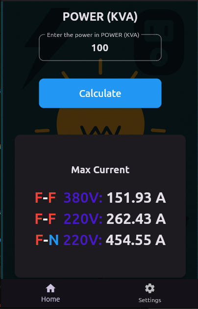

# ⚡ GMG — Calculadora de Corrente Máxima

Aplicativo desenvolvido em **Flutter** para cálculo da **corrente máxima fornecida por um Grupo Motor-Gerador (GMG)**, considerando diferentes unidades de potência.

  
  

## 🚀 Funcionalidades
- Cálculo de corrente máxima a partir da potência do GMG
- Suporte a diferentes unidades:
  - kVA
  - kW
  - CV (cavalo-vapor)
- Exibição clara dos resultados para diferentes tensões

## 🔤 Idiomas
- Português
- Inglês

  
  

## 🛠 Tecnologias utilizadas
- Flutter
- Lógica matemática aplicada
- Interface responsiva

## 🎯 Objetivo do projeto
Projeto desenvolvido com foco em **prática de lógica, cálculos técnicos e construção de interfaces em Flutter**, servindo como base para projetos mais avançados.
