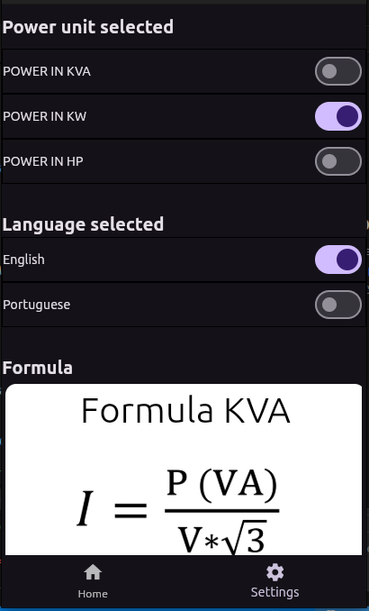
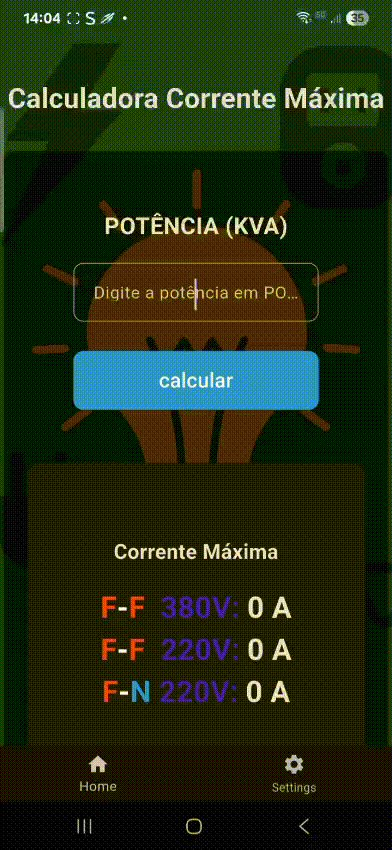
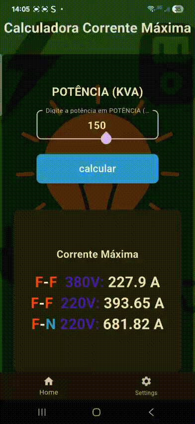

# 💱 Calculadora de corrente máxima de GMG

Aplicativo Flutter que calcula a corrente máxima fornecida por **Grupo-Motor-Gerador**.

  

## 🚀 Funcionalidades
- Calcula com diferentes potências  
- KVA, KW e CV

## 🔤 Mudanças de linguagem

